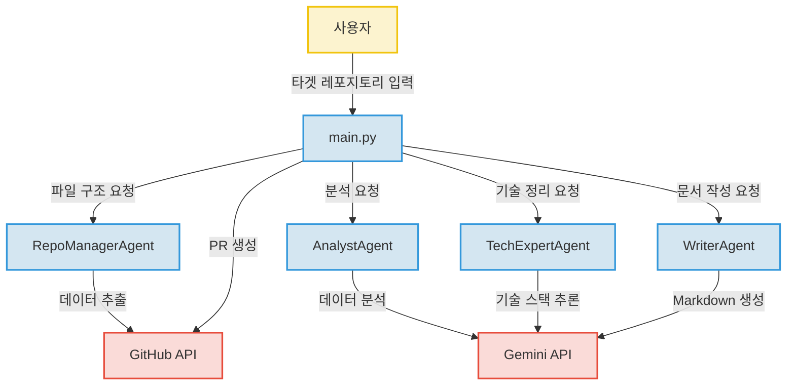

<sub>● <strong><a href="https://github.com/yeverycode/Agent">원본 저장소</a></strong>를 fork하여 <strong>학습용</strong>으로 사용한 저장소입니다.</sub><br>
<sub>● <strong><a href="https://kenel.tistory.com/414">블로그</a></strong>에서 <strong>실습 내용</strong>을 확인할 수 있습니다.</sub><br>
<sub>● 아래부터 있는 이 저장소의 README.md는 이 저장소를 통해 생성되었습니다!</sub><br>

---

# Repository Analyzer Agent

LLM(Gemini) 기반의 다중 에이전트 협업을 통해 GitHub 저장소를 분석하고, 프로젝트의 기술적 특징을 반영한 README.md를 자동 생성하여 Pull Request를 제안하는 자동화 도구입니다.

---

## 프로젝트 소개
`repository-analyzer-agent`는 오픈소스 프로젝트나 개인 작업물의 문서화 과정을 자동화하기 위해 설계되었습니다. 여러 개의 특화된 에이전트가 단계별로 프로젝트 구조를 파악하고 코드를 분석하여, 사람의 개입을 최소화하면서도 고품질의 README.md를 생성하고 이를 GitHub에 즉시 적용할 수 있도록 지원합니다.

## 주요 기능
*   **LLM 기반 도메인 추론**: 파일 구조를 분석하여 프로젝트의 성격(Backend, Frontend 등)을 파악하고 핵심 분석 대상 파일을 지능적으로 선별합니다.
*   **다층적 에이전트 협업**: 역할이 분담된 4가지 에이전트(RepoManager, Analyst, TechExpert, Writer)가 파이프라인을 구성하여 분석의 정확도를 높입니다.
*   **자동 PR 생성**: 분석된 결과물을 기반으로 README.md를 생성하고, 새로운 브랜치 생성부터 PR 게시까지의 전체 과정을 자동화합니다.

## 시스템 아키텍처
본 프로젝트는 Specialized Agent가 단계별로 역할을 수행하는 파이프라인 구조를 가집니다.



## 프로젝트 구조
```text
repository-analyzer-agent/
├── agents/             # 핵심 로직을 담당하는 4가지 특화 에이전트
│   ├── repo_manager.py # 저장소 통신 및 파일 필터링
│   ├── analyst.py      # 코드 컨텍스트 및 구조 심층 분석
│   ├── tech_expert.py  # 기술 스택 식별 및 정리
│   └── writer.py       # 문서 생성 로직
├── tools/              # 공통 유틸리티 및 함수
│   └── parser.py       # 파일 트리 및 프레임워크 힌트 추출
└── main.py             # 전체 실행 오케스트레이터
```

## 핵심 파일 설명
*   **`main.py`**: 전체 에이전트의 실행 흐름을 제어하며 API 키 관리와 타겟 저장소 대상 워크플로우를 조율합니다.
*   **`agents/repo_manager.py`**: GitHub API와 통신하여 파일 트리를 수집하고, LLM을 활용해 분석 가치가 높은 핵심 파일을 선별합니다.
*   **`agents/analyst.py`**: 선정된 파일의 내용을 분석하여 프로젝트의 기능적 특성과 코드 문맥을 파악합니다.
*   **`tools/parser.py`**: 저장소의 트리 데이터를 분석하여 파일 확장자, 중요 경로 등 프레임워크 식별을 위한 기초 데이터를 추출합니다.

## 기술 스택
*   **Python**: 범용성이 뛰어나며 복잡한 데이터 처리 및 AI 라이브러리 활용에 적합합니다.
*   **Google Gemini API**: 최신 LLM 모델을 활용하여 코드 컨텍스트 이해 및 고품질의 기술 문서 작성을 수행합니다.
*   **GitHub API**: 저장소 관리 및 자동화된 PR 생성 기능을 구현하여 개발 워크플로우를 효율화합니다.
*   **DevOps**: GitHub Actions 및 DevContainer를 활용하여 일관된 개발 환경을 구축했습니다.

## 기술 선택 이유
*   **Python**: 데이터 파싱과 LLM 연동에 최적화된 생태계를 제공하여 개발 생산성을 높였습니다.
*   **Gemini API**: 복잡한 코드 문맥을 분석하고 자연스러운 텍스트를 생성하는 데 탁월한 성능을 발휘합니다.
*   **GitHub API**: Git 워크플로우와 직접 연동되어 별도의 플랫폼 이동 없이 즉각적인 변경 사항 반영이 가능합니다.

## 실행 방법
추가 작성 필요.

## 개선 방향
*   **예외 처리 고도화**: [추정] 현재 Gemini 모델의 응답이 JSON 형식을 완벽히 준수하지 않을 경우 발생할 수 있는 파싱 오류에 대해, 보다 견고한 재시도 로직 및 에러 핸들링 보완이 필요합니다.
*   **분석 범위 확장**: 현재 파이프라인 외에 프로젝트의 테스트 커버리지나 의존성 그래프를 시각화하여 README에 포함하는 기능을 고려 중입니다.
